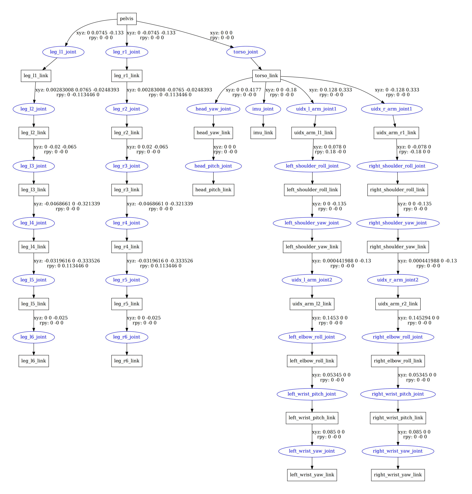
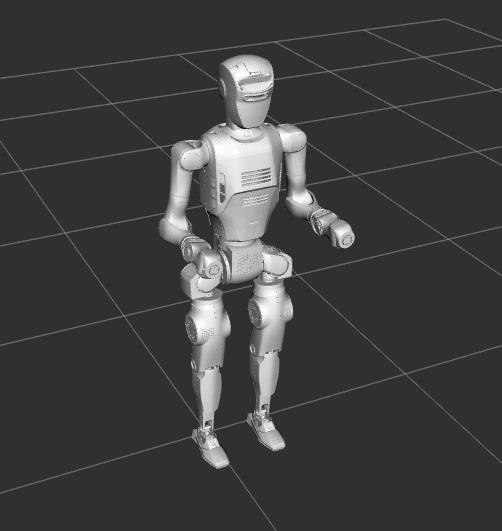

# DOBOT Atom Models · SSRobotic Collection

> **This collection has moved into [Humanoid Robot Hub](https://github.com/SSRobotic/humanoid-robot-hub).**
> Browse the consolidated code: [collections/dobot/atom-urdf](https://github.com/SSRobotic/humanoid-robot-hub/tree/main/collections/dobot/atom-urdf) · [Search resources](https://ssrobotic.github.io/humanoid-robot-hub/)

URDF / Xacro and meshes for Atom visualization and model inspection.

Curated and organized by **SSRobotic — Robotics Engineer & Open-source Curator**. Original source: [Dobot-Arm](https://github.com/Dobot-Arm/dobot_atom_urdf). The original code, documentation and license notices retain their respective authorship.

## What this collection provides

URDF / Xacro and meshes for Atom visualization and model inspection.

The Hub contains a snapshot of this repository at `6a4461f532e284ecbe7f8bc6e9413accfc923c01`. This repository is retained as an archived reference so previous links and history remain available. Updates to the curated collection belong in the Hub.

---

## Original documentation

# ✅Dobot Atom Humanoid 
  The Dobot Atom Humanoid is an educational humanoid robot designed to help students and developers learn about robotics, motion control, and AI-based applications. It features a compact and lightweight body with multi-axis servo joints that allow smooth, natural, and human-like movements. The robot supports an easy-to-use programming environment and can work with sensors and additional modules. Users can explore key robotics concepts such as inverse kinematics, motion planning, balance control, and human–robot interaction. The Dobot Atom Humanoid is ideal for robotics education, STEM learning, demonstrations, and research projects. It provides an accessible and practical way to understand and experiment with humanoid robot systems while maintaining good performance and flexibility.

# 🔧 Key Features
  Dual-arm humanoid robotic design ,Multi-axis smart servo motors for smooth motion,Supports visual programming and Python/C++ ,Expandable with sensors and additional modules ,AI-based gesture and motion programming

